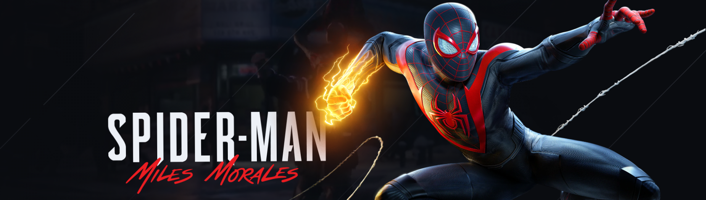

  <a href="#sobre">Sobre</a>
  <a href="#tecnologias">Tecnologias</a>
  <a href="#formulario">Formulário</a>
  <a href="#galeria">Galeria</a>
  <a href="#projeto">projeto</a>

<h1 align="center"> Projeto Spider-Man Com Formulário e Galeria de Imagens </h1>

<h2 align="center" id="sobre">Sobre</h2>

>**
💡Este Projeto é uma Landing Page um Pouco mais entusiasta Com muitas animações, decidir incluir até mesmo uma tela de loading no inicio do projeto,
>incluir um formulário e também uma galeria de imagens para dar mais interatividade para quem visita o site,, ele está responsivo para todas as resoluções
>mas no PC você vai ter uma experiência muito mais rica e completa.💡
**

<h2 id="tecnologias"> 🧙🧙 Tecnologias Utilizas 😁😉😁 </h2> 

- HTML
- CSS Com SASS
- jAVASCRIPT
- TILT JS
- GSAP

> **📚📚 As tecnologias (<a href="https://gijsroge.github.io/tilt.js/" target="_blank">Tilt JS</a>) & (<a href="https://greensock.com/gsap/)" target="_blank">GSAP</a>) são bibliotecas para animações muito completas para deixar sua pagina mais ricas e agradavel aos olhos de quem está acessando**

<h2 id="formulario"> 🧾 formulário </h2>

* Nome
* Email
* Senha
* Confirmação da Senha

>
sobre o formulário ele testa uma lógica para cada campo, verifica cada um de uma forma diferente e também exibe um texto em vermelho (🖍️) abaixo caso o usuário deixou algum campo vazio...

<h2 id="galeria"> 🎞️ galeria </h2>

> 
sobre a Galeria ela contém 14 imagens todas em alta qualidade, decidir não incluir a tag    <strong>PICTURE</strong> por que preferir deixar a resolução maxima das imagens para
>todos os dispositivos ao invéz de redimencionar cada uma delas.

<h2 id="projeto">Projeto Completo </h2>

👉 [click aqui para ver o projeto completo](https://diogokenway.github.io/projeto-spiderman/#gallery,  "Spider-Man Miles Morales") 👈